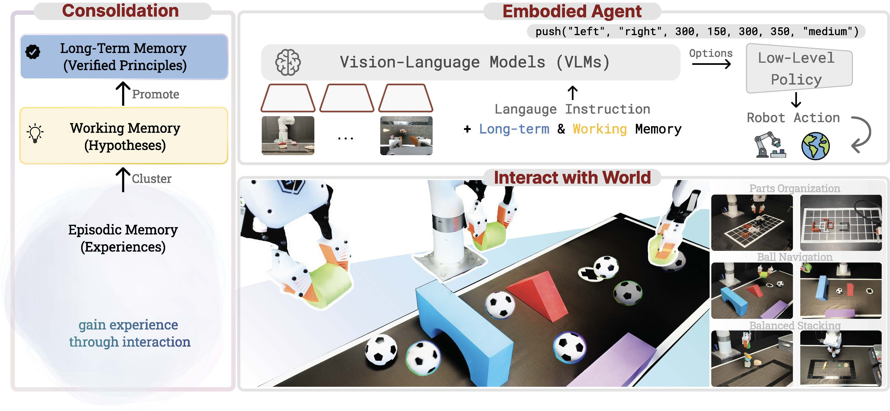

<h2 align="center">PhysMem: Self-Evolving Physical Memory for Robot Manipulation</h2>

<p align="center">
  <a href="https://arxiv.org/abs/2602.20323"></a>
  <a href="https://phys-mem.github.io/"></a>
  <a href="https://arxiv.org/pdf/2602.20323"></a>
  <a href="#license"></a>
</p>

<p align="center">
  <a href="https://haoyangli16.github.io/">Haoyang Li</a> &middot;
  <a href="https://qq456cvb.github.io/">Yang You</a> &middot;
  <a href="https://cseweb.ucsd.edu/~haosu/index.html">Hao Su</a> &middot;
  <a href="https://profiles.stanford.edu/leonidas-guibas">Leonidas Guibas</a>
</p>

<p align="center">
  Stanford University &middot; UC San Diego
</p>

<p align="center">
  
</p>

## TL;DR

- **Typed learning objectives** — Principles are categorized (AVOID, PREFER, SEQUENCE, COMPARE) to guide both generation and verification.
- **Resonance gating** — Expected experiences reinforce existing principles silently; only surprising outcomes (prediction errors) trigger new learning.
- **Ebbinghaus-inspired decay** — Unused principles fade over time; frequently validated ones persist.
- **Memory folding** — Raw experiences are compressed once covered by established principles, keeping memory bounded.
- **Three-stage scientific loop** — Experience clustering → hypothesis generation → verification & promotion to principles.

## Three-Layer Memory Architecture

PhysMem implements a scientific learning loop inspired by the scientific method:

```
Raw Experience -> [Consolidation] -> Hypotheses -> [Verification] -> Principles
```

| Layer | Storage | Lifecycle |
|-------|---------|-----------|
| **Episodic Memory** | Raw experiences (one per action) | Collected during execution, garbage-collected over time |
| **Working Memory** | Hypotheses (proposed conjectures) | Generated from clusters, tested through verification |
| **Long-term Memory** | Principles (verified rules) | Promoted from hypotheses, embedded into LLM prompts |

## Installation

```bash
git clone https://github.com/haoyangli16/PhysMem.git
cd PhysMem

# Core only (numpy)
pip install .

# With a specific LLM provider
pip install ".[openai]"          # OpenAI / Kimi
pip install ".[gemini]"          # Google Gemini
pip install ".[qwen]"            # Alibaba Qwen (uses OpenAI-compatible API)

# With all LLM providers
pip install ".[llm]"

# With FAISS similarity search (recommended)
pip install ".[faiss]"

# With clustering + semantic embedding
pip install ".[clustering]"

# Everything
pip install ".[all]"

# Editable install for development
pip install -e ".[all,dev]"
```

## Quick Start

```python
from physmem import PhysMem
from physmem.llm import create_llm

# 1. Create the memory system with an LLM backend
llm = create_llm("openai", model="gpt-4o")
mem = PhysMem(llm=llm)

# 2. Record experiences during your task loop
for episode in range(100):
    for step in range(max_steps):
        action = agent.act(observation)
        result = env.step(action)

        mem.record_experience(
            action=action,
            success=result.success,
            fail=result.fail,
            fail_tag=result.fail_reason,
            symbolic_state={
                "action_type": action.type,
                "holding": agent.is_holding,
                "progress": env.progress,
            },
            state_vec=observation.embedding,  # optional
        )

    mem.end_episode(success=env.is_success)

# 3. Get learned knowledge
principles = mem.get_principles()
for p in principles:
    print(f"[{p.principle_type}] {p.content} (confidence: {p.confidence:.2f})")

# 4. Inject principles into LLM prompts
prompt_text = mem.get_principles_prompt(action_type="grasp")
```

## Without LLM (Rule-Based)

PhysMem works without an LLM too — it uses rule-based hypothesis generation:

```python
from physmem import PhysMem

mem = PhysMem()  # No LLM needed

mem.record_experience(action="push", success=False, fail=True, fail_tag="collision")
mem.record_experience(action="push", success=False, fail=True, fail_tag="collision")
mem.record_experience(action="lift", success=True)

mem.end_episode(success=True)
```

## Custom LLM Backend

Implement `BaseLLM` to use any LLM:

```python
from physmem.llm.base import BaseLLM

class MyLLM(BaseLLM):
    def generate(self, prompt, system_prompt=None, **kwargs):
        return my_api.call(prompt, system=system_prompt)

mem = PhysMem(llm=MyLLM())
```

## Configuration

```python
from physmem import PhysMem, ScientificLearningConfig

config = ScientificLearningConfig(
    memory_name="my_robot",
    max_memory_size=5000,
    consolidation_interval=30,      # Consolidate every 30 episodes
    max_hypotheses_per_cluster=3,
    max_principles_in_prompt=5,
    promotion_confidence=0.8,       # Confidence threshold for promotion
    save_path="./checkpoints",      # Auto-save directory
    auto_save_interval=50,          # Save every 50 episodes
)

mem = PhysMem(config=config, llm=llm)
```

## Persistence

```python
# Save
mem.save_state("./my_checkpoint")

# Load
mem = PhysMem.load_state("./my_checkpoint", llm=llm)
```

## Architecture

```
physmem/
├── __init__.py          # Public API: PhysMem, Experience, Principle, ...
├── core/                # Data structures
│   ├── experience.py    # Experience, MemoryBank
│   ├── hypothesis.py    # Hypothesis, HypothesisStore, ExperienceCluster
│   ├── principle.py     # Principle, PrincipleStore, PrincipleType
│   ├── index.py         # FAISS/numpy vector index
│   ├── retriever.py     # k-NN retrieval with symbolic filtering
│   └── writeback.py     # Write-back policy
├── learning/            # Learning loop
│   ├── consolidation.py # Clustering + hypothesis generation
│   ├── verification.py  # Hypothesis testing + promotion
│   └── loop.py          # ScientificLearningLoop (main orchestrator)
├── llm/                 # LLM integration
│   ├── base.py          # Abstract BaseLLM interface
│   └── providers.py     # OpenAI, Gemini, Qwen, Kimi implementations
└── examples/            # Usage examples
    ├── quickstart.py    # Minimal example
    └── reflect_vlm/     # Integration with reflect-vlm assembly task
```

## Key Concepts

### Surprise-Driven Learning
Not all experiences trigger learning. The system checks if an experience matches existing principles (resonance). Only surprising experiences (prediction errors) are sent to consolidation, reducing computational cost.

### Experience Folding
Once principles are established, the raw experiences that support them can be "folded" (compressed). This keeps memory bounded while preserving learned knowledge.

### Hypothesis Verification
Hypotheses aren't blindly promoted. The system uses a verification planner that designs experiments, tracks results, and only promotes hypotheses that pass confidence thresholds.

## Citation

If you find this work useful, please cite:

```bibtex
@article{li2025physmem,
  title   = {PhysMem: Self-Evolving Physical Memory for Robot Manipulation},
  author  = {Li, Haoyang and You, Yang and Su, Hao and Guibas, Leonidas},
  journal = {arXiv preprint arXiv:2602.20323},
  year    = {2025}
}
```

## License

This project is licensed under the MIT License.
